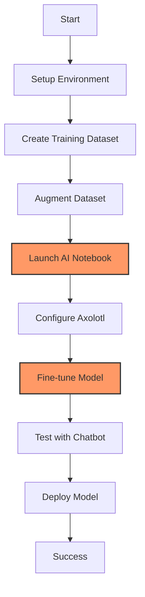

# LLM Fine-Tuning Workbook - OVHcloud AI Services

!!! info "About this workbook"
    This comprehensive workbook will walk you through fine-tuning a Large Language Model using the Axolotl framework and OVHcloud AI services. Follow each step carefully to master the complete LLM fine-tuning workflow from dataset creation to model testing.

## Prerequisites

- [ ] OVHcloud account with Public Cloud project created
- [ ] OVHcloud AI Endpoints valid API key stored in environment variable `OVH_AI_ENDPOINTS_ACCESS_TOKEN`
- [ ] Valid AI Endpoint model URL stored in environment variable `OVH_AI_ENDPOINTS_MODEL_URL`
- [ ] Valid AI Endpoint model name stored in environment variable `OVH_AI_ENDPOINTS_MODEL_NAME`
- [ ] Hugging Face account with valid API token stored in environment variable `HF_TOKEN`
- [ ] Optional: Weights & Biases account for training monitoring (API token in `WANDB_TOKEN`)
- [ ] Python 3.9+ installed locally (for dataset preparation)
- [ ] Docker installed (for local chatbot testing)
- [ ] Basic understanding of machine learning concepts
- [ ] Familiarity with command-line interface

## Understanding the Code

Before we start, let's understand what we'll be building. This workbook covers the complete LLM fine-tuning pipeline using OVHcloud services:

!!! example "Source Code Overview"
    
    === "📋 All Files"
        **Repository**: [ovh/public-cloud-examples](https://github.com/ovh/public-cloud-examples/tree/main/ai/llm-fine-tune)
        
        | File | Purpose | Action |
        |------|---------|--------|
        | `requirements.txt` | Python dependencies for dataset creation | [📥 Download](https://raw.githubusercontent.com/ovh/public-cloud-examples/main/ai/llm-fine-tune/requirements.txt) |
        | `dataset/DatasetCreation.py` | Generate training data from documentation | [📥 Download](https://raw.githubusercontent.com/ovh/public-cloud-examples/main/ai/llm-fine-tune/dataset/DatasetCreation.py) |
        | `dataset/DatasetAugmentation.py` | Create synthetic training data | [📥 Download](https://raw.githubusercontent.com/ovh/public-cloud-examples/main/ai/llm-fine-tune/dataset/DatasetAugmentation.py) |
        | `notebook/instruct-lora-1b-ai-endpoints.yml` | Axolotl training configuration | [📥 Download](https://raw.githubusercontent.com/ovh/public-cloud-examples/main/ai/llm-fine-tune/notebook/instruct-lora-1b-ai-endpoints.yml) |
        | `notebook/axolto-llm-fine-tune-Meta-Llama-3.2-1B-instruct-ai-endpoints.ipynb` | Training notebook | [📥 Download](https://raw.githubusercontent.com/ovh/public-cloud-examples/main/ai/llm-fine-tune/notebook/axolto-llm-fine-tune-Meta-Llama-3.2-1B-instruct-ai-endpoints.ipynb) |
        | `chatbot/chatbot.py` | Testing chatbot interface | [📥 Download](https://raw.githubusercontent.com/ovh/public-cloud-examples/main/ai/llm-fine-tune/chatbot/chatbot.py) |
        | `chatbot/Dockerfile` | Docker container for chatbot | [📥 Download](https://raw.githubusercontent.com/ovh/public-cloud-examples/main/ai/llm-fine-tune/chatbot/Dockerfile) |
        | `chatbot/requirements.txt` | Chatbot dependencies | [📥 Download](https://raw.githubusercontent.com/ovh/public-cloud-examples/main/ai/llm-fine-tune/chatbot/requirements.txt) |
    
    === "📖 Code Structure"
        **Fine-Tuning Pipeline**:
        
        `dataset/DatasetCreation.py`  
        Generates Q&A pairs from OVHcloud AI Endpoints documentation using LLM
        
        `dataset/DatasetAugmentation.py`  
        Creates synthetic variations of the training data for better model generalization
        
        `notebook/instruct-lora-1b-ai-endpoints.yml`  
        Axolotl configuration for LoRA fine-tuning of Llama-3.2-1B-Instruct
        
        `notebook/axolto-llm-fine-tune-Meta-Llama-3.2-1B-instruct-ai-endpoints.ipynb`  
        Jupyter notebook for running the training process on OVHcloud AI Notebooks
        
        `chatbot/chatbot.py`  
        Gradio-based testing interface to compare base vs fine-tuned models
        
        ---
        
        **Key Features**:
        
        • **Automated Dataset Creation** from documentation using LLM  
        • **LoRA Fine-Tuning** for efficient model adaptation  
        • **GPU-Accelerated Training** using OVHcloud AI Notebooks  
        • **Model Comparison** interface for testing improvements  
        • **Docker Containerization** for easy deployment
    
    === "🚀 Complete Setup Commands"
        ```bash
        # Quick setup for experienced users
        
        # 1. Clone repository
        git clone https://github.com/ovh/public-cloud-examples.git
        cd public-cloud-examples/ai/llm-fine-tune
        
        # 2. Set environment variables
        export OVH_AI_ENDPOINTS_ACCESS_TOKEN="your_api_token"
        export OVH_AI_ENDPOINTS_MODEL_URL="https://oai.endpoints.kepler.ai.cloud.ovh.net/v1"
        export OVH_AI_ENDPOINTS_MODEL_NAME="Meta-Llama-3_3-70B-Instruct"
        export HF_TOKEN="your_huggingface_token"
        
        # 3. Create datasets locally
        pip install -r requirements.txt
        mkdir -p dataset/generated dataset/generated/synthetic
        python dataset/DatasetCreation.py
        python dataset/DatasetAugmentation.py
        
        # 4. Launch AI Notebook for training
        ovhai notebook run conda jupyterlab \
            --name axolto-llm-fine-tune \
            --framework-version 25.3.1-py312-cudadevel128-gpu \
            --flavor l4-1-gpu \
            --gpu 1 \
            --volume https://github.com/ovh/public-cloud-examples.git:/workspace/public-cloud-examples:RW \
            --envvar HF_TOKEN=$HF_TOKEN \
            --envvar WANDB_TOKEN=$WANDB_TOKEN \
            --unsecure-http
        
        # 5. Test with chatbot
        cd chatbot
        docker build -t fine-tune-chatbot .
        docker run -p 7860:7860 -e OVH_AI_ENDPOINTS_ACCESS_TOKEN=$OVH_AI_ENDPOINTS_ACCESS_TOKEN fine-tune-chatbot
        ```



## Step 1: Environment Setup and Prerequisites

!!! tip "API Keys and Tokens"
    This workbook requires several API keys. Gather them before starting to ensure a smooth experience.

### OVHcloud AI Endpoints Setup

First, ensure you have access to OVHcloud AI Endpoints and retrieve your credentials:

=== "OVH CLI Method"
    ```bash
    # Install OVH CLI if not already installed
    pip install ovh
    
    # Configure AI Endpoints access
    ovhai auth login
    
    # List available models
    ovhai capabilities model list
    
    # Get your endpoint details
    ovhai endpoint list
    ```

=== "Manual Setup"
    ```bash
    # Set your OVHcloud AI Endpoints credentials
    export OVH_AI_ENDPOINTS_ACCESS_TOKEN="your_api_token_here"
    export OVH_AI_ENDPOINTS_MODEL_URL="https://oai.endpoints.kepler.ai.cloud.ovh.net/v1"
    export OVH_AI_ENDPOINTS_MODEL_NAME="Meta-Llama-3_3-70B-Instruct"
    ```

### Hugging Face Setup

Create a Hugging Face account and get your access token:

```bash
# Set your Hugging Face token
export HF_TOKEN="your_huggingface_token_here"

# Optional: Set Weights & Biases token for training monitoring
export WANDB_TOKEN="your_wandb_token_here"
```

Expected output after setting environment variables:
```
Environment variables configured:
✅ OVH_AI_ENDPOINTS_ACCESS_TOKEN set
✅ OVH_AI_ENDPOINTS_MODEL_URL set  
✅ OVH_AI_ENDPOINTS_MODEL_NAME set
✅ HF_TOKEN set
```

## Step 2: Clone Repository and Setup Local Environment

!!! tip "Local Development Setup"
    We'll prepare the dataset locally before uploading to OVHcloud AI Notebooks for GPU training.

```bash
# Clone the repository
git clone https://github.com/ovh/public-cloud-examples.git
cd public-cloud-examples/ai/llm-fine-tune

# Create virtual environment
python3 -m venv fine-tuning-env
source fine-tuning-env/bin/activate  # On Windows: fine-tuning-env\Scripts\activate

# Install dependencies
pip install -r requirements.txt
```

You should see output like:
```
Cloning into 'public-cloud-examples'...
remote: Enumerating objects: 1234, done.
remote: Counting objects: 100% (1234/1234), done.
✅ Successfully activated virtual environment
✅ Dependencies installed successfully
```

Create necessary directories for dataset generation:

```bash
mkdir -p dataset/generated
mkdir -p dataset/generated/synthetic
```

## Step 3: Generate Training Dataset

!!! info "Dataset Creation Process"
    We'll create a specialized dataset for OVHcloud AI Endpoints by extracting Q&A pairs from official documentation.

### Understanding the Dataset Creation Script

The `DatasetCreation.py` script processes OVHcloud AI Endpoints documentation to create training data:

```bash
# First, let's examine the script
cat dataset/DatasetCreation.py
```

### Download OVHcloud Documentation

```bash
# Clone the documentation repository
git clone https://github.com/ovh/docs.git
cd docs

# Navigate back to our working directory
cd ../
```

### Run Dataset Creation

```bash
# Generate the initial dataset
python dataset/DatasetCreation.py
```

Expected output:
```
📗 Guide processed: ai-endpoints-getting-started
✅ Dataset generated: ./generated/ai-endpoints-getting-started.json
📗 Guide processed: ai-endpoints-models
✅ Dataset generated: ./generated/ai-endpoints-models.json
📗 Guide processed: ai-endpoints-best-practices
✅ Dataset generated: ./generated/ai-endpoints-best-practices.json
```

**Note**: This process may take 5-10 minutes depending on the amount of documentation and AI Endpoints response time.

### Verify Generated Datasets

```bash
# List generated files
ls -la dataset/generated/

# Check a sample dataset
head -n 20 dataset/generated/ai-endpoints-getting-started.json
```

You should see JSON files containing question-answer pairs like:
```json
{
  "messages": [
    {
      "role": "user",
      "content": "What are the requirements for OVHcloud AI Endpoints?"
    },
    {
      "role": "assistant", 
      "content": "OVHcloud AI Endpoints requires..."
    }
  ]
}
```

## Step 4: Augment Dataset with Synthetic Data

!!! tip "Dataset Augmentation"
    Creating variations of our training data improves model generalization and prevents overfitting.

### Run Dataset Augmentation

```bash
# Generate synthetic variations
python dataset/DatasetAugmentation.py
```

Expected output:
```
📂 Directory path: generated
📜 Processing file: generated/ai-endpoints-getting-started.json
✅ Input dataset valide: ai-endpoints-getting-started.json
✅ Successfully generated file: 12345678-9abc-def0-1234-56789abcdef0_ai-endpoints-getting-started.json
📜 Processing file: generated/ai-endpoints-models.json
✅ Input dataset valide: ai-endpoints-models.json
✅ Successfully generated file: 87654321-9abc-def0-1234-56789abcdef0_ai-endpoints-models.json
```

### Verify Augmented Datasets

```bash
# Check synthetic data
ls -la dataset/generated/synthetic/

# Count total training examples
find dataset/generated -name "*.json" -exec jq '.messages | length' {} \; | paste -sd+ | bc
```

You should see a significant number of training examples:
```
Total training examples: 456
✅ Dataset augmentation completed successfully
```

## Step 5: Launch OVHcloud AI Notebook for Training

!!! info "GPU Training Environment" 
    OVHcloud AI Notebooks provides GPU-accelerated environments perfect for LLM fine-tuning with Axolotl.

### Create AI Notebook Instance

```bash
# Launch AI Notebook with GPU support
ovhai notebook run conda jupyterlab \
    --name axolto-llm-fine-tune \
    --framework-version 25.3.1-py312-cudadevel128-gpu \
    --flavor l4-1-gpu \
    --gpu 1 \
    --volume https://github.com/ovh/public-cloud-examples.git:/workspace/public-cloud-examples:RW \
    --envvar HF_TOKEN=$HF_TOKEN \
    --envvar WANDB_TOKEN=$WANDB_TOKEN \
    --unsecure-http
```

Expected output:
```
✅ Notebook "axolto-llm-fine-tune" created successfully
🔗 Access URL: https://12345678-9abc-def0-1234-56789abcdef0.notebook.gra.ai.cloud.ovh.net
🖥️  Instance: l4-1-gpu (1 GPU, 24GB VRAM)
⏱️  Estimated startup time: 2-3 minutes
```

**Note**: The notebook startup may take 2-3 minutes. Wait for the "Running" status before proceeding.

### Verify Notebook Status

```bash
# Check notebook status
ovhai notebook list

# Get detailed info
ovhai notebook get axolto-llm-fine-tune
```

## Step 6: Upload Training Data to AI Notebook

!!! tip "Data Transfer"
    Upload your generated datasets to the AI Notebook environment for training.

### Access the Notebook

1. Click on the provided URL from the previous step
2. Navigate to `/workspace/public-cloud-examples/ai/llm-fine-tune/notebook/`
3. Create the `ai-endpoints-doc` folder if it doesn't exist

### Upload Dataset Files

Using the JupyterLab interface:

=== "Via JupyterLab Upload"
    1. In JupyterLab, navigate to `notebook/ai-endpoints-doc/`
    2. Click the "Upload" button
    3. Select all JSON files from your local `dataset/generated/` and `dataset/generated/synthetic/` folders
    4. Wait for upload completion

=== "Via Terminal in Notebook"
    ```bash
    # In the notebook terminal
    cd /workspace/public-cloud-examples/ai/llm-fine-tune/notebook
    mkdir -p ai-endpoints-doc
    
    # You'll need to manually copy files or use git to sync
    # This is typically done via the JupyterLab interface
    ```

### Verify Data Upload

In a notebook cell, run:

```python
import os
import json

# Check uploaded files
data_dir = "/workspace/public-cloud-examples/ai/llm-fine-tune/notebook/ai-endpoints-doc/"
files = [f for f in os.listdir(data_dir) if f.endswith('.json')]
print(f"✅ Found {len(files)} dataset files")

# Verify data format
if files:
    with open(os.path.join(data_dir, files[0])) as f:
        sample = json.load(f)
    print(f"✅ Sample data format verified: {len(sample.get('messages', []))} messages")
```

Expected output:
```
✅ Found 8 dataset files
✅ Sample data format verified: 24 messages
```

## Step 7: Configure Axolotl for Fine-Tuning

!!! info "Axolotl Configuration"
    Axolotl is a powerful framework for fine-tuning LLMs. We'll use LoRA (Low-Rank Adaptation) for efficient training.

### Review Configuration File

Open and examine the `instruct-lora-1b-ai-endpoints.yml` file:

```yaml
base_model: meta-llama/Llama-3.2-1B-Instruct
model_type: LlamaForCausalLM
tokenizer_type: AutoTokenizer

load_in_8bit: true
load_in_4bit: false

datasets:
  - path: /workspace/public-cloud-examples/ai/llm-fine-tune/notebook/ai-endpoints-doc/
    type: chat_template
    field_messages: messages
    message_property_mappings:
      role: role
      content: content
    roles:
      user:
        - user
      assistant:
        - assistant

val_set_size: 0.01
output_dir: /workspace/out/llama-3.2-1b-ai-endpoints

sequence_len: 4096
sample_packing: false
pad_to_sequence_len: true

adapter: lora
lora_r: 32
lora_alpha: 16
lora_dropout: 0.05
lora_target_linear: true

wandb_project: ai_endpoints_training
wandb_entity: <W&B id>

gradient_accumulation_steps: 4
micro_batch_size: 2
num_epochs: 10
optimizer: adamw_bnb_8bit
lr_scheduler: cosine
learning_rate: 0.0002

bf16: auto
tf32: false
gradient_checkpointing: true
logging_steps: 1
flash_attention: true

warmup_steps: 10
evals_per_epoch: 4
saves_per_epoch: 1
weight_decay: 0.0
special_tokens:
   pad_token: <|end_of_text|>
```

### Key Configuration Parameters

- **Base Model**: Llama-3.2-1B-Instruct (efficient for fine-tuning)
- **LoRA Settings**: r=32, alpha=16 (good balance of performance and efficiency)
- **Training**: 10 epochs with cosine learning rate scheduling
- **Memory Optimization**: 8-bit loading and gradient checkpointing

## Step 8: Run Fine-Tuning Training

!!! warning "Training Duration"
    Fine-tuning will take approximately 30-60 minutes depending on dataset size and model complexity.

### Open Training Notebook

1. In JupyterLab, open `axolto-llm-fine-tune-Meta-Llama-3.2-1B-instruct-ai-endpoints.ipynb`
2. Execute each cell sequentially

### Install Dependencies

In the first notebook cell:

```python
# Install Axolotl and dependencies
!pip install -e git+https://github.com/OpenAccess-AI-Collective/axolotl.git#egg=axolotl[flash-attn,deepspeed]
!pip install torch torchvision torchaudio --index-url https://download.pytorch.org/whl/cu121
```

### Verify GPU Access

```python
import torch
print(f"✅ CUDA available: {torch.cuda.is_available()}")
print(f"✅ GPU count: {torch.cuda.device_count()}")
print(f"✅ Current device: {torch.cuda.current_device()}")
print(f"✅ Device name: {torch.cuda.get_device_name(0)}")
```

Expected output:
```
✅ CUDA available: True
✅ GPU count: 1
✅ Current device: 0
✅ Device name: NVIDIA L4
```

### Start Training

```python
# Change to the correct directory
import os
os.chdir('/workspace/public-cloud-examples/ai/llm-fine-tune/notebook')

# Run Axolotl training
!axolotl train instruct-lora-1b-ai-endpoints.yml
```

### Monitor Training Progress

During training, you'll see output like:
```
[INFO] Loading model meta-llama/Llama-3.2-1B-Instruct
[INFO] Model loaded successfully
[INFO] Processing dataset...
[INFO] Dataset processed: 456 examples
[INFO] Starting training...
Epoch 1/10: 100%|██████████| 57/57 [08:45<00:00,  0.11it/s, loss=2.456]
Epoch 2/10: 100%|██████████| 57/57 [08:32<00:00,  0.11it/s, loss=1.987]
...
[INFO] Training completed successfully!
[INFO] Model saved to: /workspace/out/llama-3.2-1b-ai-endpoints
```

**Note**: Training typically takes 30-60 minutes. Monitor the loss values - they should decrease over time.

## Step 9: Test Fine-Tuned Model

!!! tip "Model Evaluation"
    Compare your fine-tuned model with the base model to evaluate improvements.

### Save Model to Hugging Face Hub

In the notebook:

```python
# Upload trained model to Hugging Face Hub
from huggingface_hub import login
login(token=os.environ['HF_TOKEN'])

# Push model
!axolotl inference instruct-lora-1b-ai-endpoints.yml \
    --lora-model-dir="/workspace/out/llama-3.2-1b-ai-endpoints" \
    --prompt="What is OVHcloud AI Endpoints?"
```

### Download Model Locally (Optional)

```bash
# From your local machine
mkdir -p models/fine-tuned
scp -r your-notebook:/workspace/out/llama-3.2-1b-ai-endpoints models/fine-tuned/
```

## Step 10: Setup Testing Chatbot

!!! info "Chatbot Testing Interface"
    Test your fine-tuned model using the provided Gradio chatbot interface.

### Build Chatbot Docker Image

```bash
# Navigate to chatbot directory
cd public-cloud-examples/ai/llm-fine-tune/chatbot

# Build Docker image
docker build -t fine-tune-chatbot:1.0.0 .
```

Expected output:
```
[+] Building 45.2s (12/12) FINISHED
 => [internal] load build definition from Dockerfile
 => => transferring dockerfile: 234B
 => [internal] load .dockerignore
 => CACHED [1/6] FROM python:3.11-slim
 => [2/6] WORKDIR /app
 => [3/6] COPY requirements.txt .
 => [4/6] RUN pip install -r requirements.txt
 => [5/6] COPY chatbot.py .
 => [6/6] COPY . .
 => exporting to image
 => => exporting layers
 => => writing image sha256:abc123...
 => => naming to docker.io/library/fine-tune-chatbot:1.0.0
✅ Successfully built fine-tune-chatbot:1.0.0
```

### Run Chatbot Locally

```bash
# Run chatbot with environment variables
docker run -p 7860:7860 \
    -e OVH_AI_ENDPOINTS_ACCESS_TOKEN=$OVH_AI_ENDPOINTS_ACCESS_TOKEN \
    fine-tune-chatbot:1.0.0
```

Expected output:
```
 * Running on http://0.0.0.0:7860
 * Debug mode: off
✅ Chatbot interface available at http://localhost:7860
```

### Access Chatbot Interface

1. Open your browser to `http://localhost:7860`
2. You'll see a Gradio interface with:
   - System prompt configuration
   - Model settings (temperature, top_p)
   - Model URL and API key fields
   - Chat interface

### Testing Scenarios

!!! example "Test Cases"
    Try these scenarios to evaluate your fine-tuned model's performance.

#### Basic Functionality Test

**Prompt**: "What is OVHcloud AI Endpoints?"

**Expected Response**: Detailed explanation specific to OVHcloud AI Endpoints service.

#### Advanced Features Test

**Prompt**: "How many requests per minute can I make with AI Endpoints?"

**Expected Response**: Specific rate limiting information for OVHcloud AI Endpoints.

#### Error Handling Test

**Prompt**: "Tell me about AWS Lambda functions"

**Expected Response**: "This product doesn't exist in OVHcloud" (since the model was trained specifically on OVHcloud documentation).

### Compare Models

Test the same questions with:

1. **Base Model**: Use original Llama-3.2-1B-Instruct
2. **Fine-Tuned Model**: Use your trained model

Document the differences in:
- Response accuracy
- OVHcloud-specific knowledge
- Response relevance

## Step 11: Deploy Chatbot to OVHcloud AI Deploy

!!! tip "Production Deployment"
    Deploy your chatbot to OVHcloud AI Deploy for public access and scalability.

### Push Docker Image to Registry

```bash
# Tag for registry (replace with your registry)
docker tag fine-tune-chatbot:1.0.0 your-registry/fine-tune-chatbot:1.0.0

# Push to registry
docker push your-registry/fine-tune-chatbot:1.0.0
```

### Deploy with OVHcloud AI Deploy

```bash
# Deploy chatbot application
ovhai app run \
    --name fine-tune-chatbot \
    --cpu 1 \
    --memory 2Gi \
    --default-http-port 7860 \
    --env OVH_AI_ENDPOINTS_ACCESS_TOKEN=$OVH_AI_ENDPOINTS_ACCESS_TOKEN \
    --unsecure-http \
    your-registry/fine-tune-chatbot:1.0.0
```

Expected output:
```
✅ Application "fine-tune-chatbot" deployed successfully
🔗 Public URL: https://12345678-9abc-def0-1234-56789abcdef0.app.gra.ai.cloud.ovh.net
🖥️  Resources: 1 CPU, 2Gi memory
⏱️  Estimated startup time: 1-2 minutes
```

### Monitor Deployment

```bash
# Check application status
ovhai app list

# Get deployment logs
ovhai app logs fine-tune-chatbot
```

## Step 12: Advanced Model Optimization

!!! info "Performance Tuning"
    Optimize your fine-tuned model for better performance and efficiency.

### Quantization Options

For production deployment, consider model quantization:

```python
# In your notebook, quantize the model
from transformers import AutoModelForCausalLM, AutoTokenizer
import torch

# Load fine-tuned model
model = AutoModelForCausalLM.from_pretrained(
    "/workspace/out/llama-3.2-1b-ai-endpoints",
    torch_dtype=torch.float16,
    device_map="auto"
)

# Apply 4-bit quantization
model = model.to(torch.device("cuda"))
model = torch.quantization.quantize_dynamic(
    model, {torch.nn.Linear}, dtype=torch.qint8
)

# Save quantized model
model.save_pretrained("/workspace/out/llama-3.2-1b-ai-endpoints-quantized")
```

### Model Evaluation Metrics

Evaluate your model systematically:

```python
import json
from transformers import pipeline

# Load evaluation dataset
eval_data = []
for file in os.listdir("ai-endpoints-doc"):
    if file.endswith('.json'):
        with open(f"ai-endpoints-doc/{file}") as f:
            data = json.load(f)
            eval_data.extend(data['messages'])

# Create evaluation pipeline
pipe = pipeline(
    "text-generation",
    model="/workspace/out/llama-3.2-1b-ai-endpoints",
    tokenizer="/workspace/out/llama-3.2-1b-ai-endpoints",
    device="cuda"
)

# Evaluate on sample questions
correct_answers = 0
total_questions = 0

for i in range(0, len(eval_data), 2):  # Skip every other (user/assistant pairs)
    if i + 1 < len(eval_data):
        question = eval_data[i]['content']
        expected = eval_data[i + 1]['content']
        
        # Generate response
        response = pipe(question, max_length=200, num_return_sequences=1)
        generated = response[0]['generated_text']
        
        # Simple evaluation (you might want more sophisticated metrics)
        if "OVHcloud" in generated and len(generated) > 50:
            correct_answers += 1
        total_questions += 1

accuracy = correct_answers / total_questions
print(f"✅ Model accuracy: {accuracy:.2%}")
```

## Clean Up

!!! warning "Resource Management"
    Clean up resources to avoid unnecessary charges.

### Stop AI Notebook

```bash
# Stop the training notebook
ovhai notebook stop axolto-llm-fine-tune

# Optional: Delete if no longer needed
ovhai notebook delete axolto-llm-fine-tune
```

### Stop AI Deploy Application

```bash
# Stop the chatbot application
ovhai app stop fine-tune-chatbot

# Optional: Delete if no longer needed
ovhai app delete fine-tune-chatbot
```

### Preserve Important Artifacts

```bash
# Keep these for future use:
# - Fine-tuned model files
# - Generated datasets
# - Configuration files
# - Docker images

# Local cleanup
deactivate  # Exit virtual environment
cd ..
rm -rf public-cloud-examples  # Only if you want to clean up completely
```

## Troubleshooting

### Common Issues

**GPU Memory Issues**:
```bash
# If you encounter CUDA out of memory errors
# Reduce batch size in config
micro_batch_size: 1  # Instead of 2
gradient_accumulation_steps: 8  # Instead of 4
```

**Dataset Format Errors**:
- Symptom: Training fails with JSON parsing errors
- Solution: Validate JSON files with `jq` command
- Prevention: Always test dataset creation scripts with small samples first

**Model Loading Issues**:
```bash
# If model loading fails
# Check Hugging Face token permissions
huggingface-cli whoami

# Verify model access
huggingface-cli repo info meta-llama/Llama-3.2-1B-Instruct
```

**Slow Training**:
- Check GPU utilization: `nvidia-smi`
- Verify flash attention is working
- Consider reducing sequence length if needed

**Chatbot Connection Issues**:
- Verify environment variables are set correctly
- Check AI Endpoints API status
- Test with curl: `curl -H "Authorization: Bearer $OVH_AI_ENDPOINTS_ACCESS_TOKEN" $OVH_AI_ENDPOINTS_MODEL_URL/models`

### Performance Optimization Tips

1. **Dataset Quality**: Ensure high-quality, diverse training examples
2. **Training Duration**: Monitor loss curves to avoid overfitting
3. **LoRA Parameters**: Experiment with r and alpha values
4. **Batch Size**: Balance between memory usage and training stability
5. **Learning Rate**: Use learning rate scheduling for better convergence

## Quick Start Summary

For experienced users, here's the complete workflow:

```bash
# 1. Setup environment
export OVH_AI_ENDPOINTS_ACCESS_TOKEN="your_token"
export OVH_AI_ENDPOINTS_MODEL_URL="your_url"
export OVH_AI_ENDPOINTS_MODEL_NAME="your_model"
export HF_TOKEN="your_hf_token"

# 2. Clone and prepare data
git clone https://github.com/ovh/public-cloud-examples.git
cd public-cloud-examples/ai/llm-fine-tune
python3 -m venv env && source env/bin/activate
pip install -r requirements.txt
mkdir -p dataset/generated dataset/generated/synthetic
python dataset/DatasetCreation.py
python dataset/DatasetAugmentation.py

# 3. Launch training
ovhai notebook run conda jupyterlab \
    --name axolto-llm-fine-tune \
    --framework-version 25.3.1-py312-cudadevel128-gpu \
    --flavor l4-1-gpu --gpu 1 \
    --volume https://github.com/ovh/public-cloud-examples.git:/workspace/public-cloud-examples:RW \
    --envvar HF_TOKEN=$HF_TOKEN --unsecure-http

# 4. Upload data and run training notebook
# (Manual step in JupyterLab interface)

# 5. Test with chatbot
cd chatbot
docker build -t fine-tune-chatbot .
docker run -p 7860:7860 -e OVH_AI_ENDPOINTS_ACCESS_TOKEN=$OVH_AI_ENDPOINTS_ACCESS_TOKEN fine-tune-chatbot

# 6. Deploy to production
ovhai app run --name fine-tune-chatbot --cpu 1 --default-http-port 7860 \
    --env OVH_AI_ENDPOINTS_ACCESS_TOKEN=$OVH_AI_ENDPOINTS_ACCESS_TOKEN \
    --unsecure-http your-registry/fine-tune-chatbot:1.0.0
```

Congratulations! You've successfully completed the LLM fine-tuning workflow using OVHcloud AI services. Your model is now specialized for OVHcloud AI Endpoints questions and ready for production use.