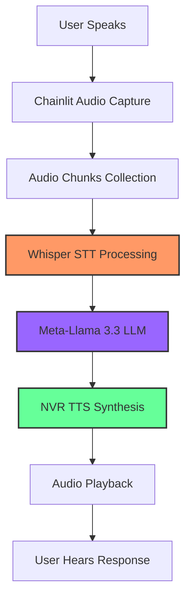

# Chainlit Voice Assistant Workbook - Real-time AI Voice Interaction

!!! info "About this workbook"
    This comprehensive workbook will walk you through building a real-time voice assistant using Chainlit framework with OVHcloud AI Endpoints. Follow each step carefully to create a fully functional voice-to-voice AI assistant with speech recognition, language processing, and text-to-speech capabilities.

## Prerequisites

- [ ] OVHcloud account with AI Endpoints access
- [ ] Python 3.8+ installed
- [ ] Basic Python programming knowledge
- [ ] Chrome or Edge browser (recommended for audio support)
- [ ] Microphone access on your device
- [ ] Linux/macOS/Windows environment

## Understanding the Code

Before we start, let's understand what we'll be building. This voice assistant combines three powerful AI models in a seamless real-time pipeline:

!!! example "Source Code Overview"
    
    === "📋 All Files"
        **Repository**: [ovh/public-cloud-examples](https://github.com/ovh/public-cloud-examples/tree/main/ai/ai-endpoints/python-chainlit-voiceassistant)
        
        | File | Purpose | Action |
        |------|---------|--------|
        | `requirements.txt` | Python dependencies | [📥 Download](https://raw.githubusercontent.com/ovh/public-cloud-examples/main/ai/ai-endpoints/python-chainlit-voiceassistant/requirements.txt) |
        | `voice_assistant.py` | Main voice assistant application | [📥 Download](https://raw.githubusercontent.com/ovh/public-cloud-examples/main/ai/ai-endpoints/python-chainlit-voiceassistant/voice_assistant.py) |
        | `.env.template` | Environment variables template | [📥 Download](https://raw.githubusercontent.com/ovh/public-cloud-examples/main/ai/ai-endpoints/python-chainlit-voiceassistant/.env.template) |
        | `.chainlit/config.toml` | Chainlit configuration | [📥 Download](https://raw.githubusercontent.com/ovh/public-cloud-examples/main/ai/ai-endpoints/python-chainlit-voiceassistant/.chainlit/config.toml) |
    
    === "📖 Code Structure"
        **Voice Processing Pipeline**:
        
        `voice_assistant.py`  
        Complete voice assistant with real-time audio processing, AI inference, and speech synthesis
        
        **Audio Handlers**:
        - `@cl.on_audio_start` - Initialize recording session
        - `@cl.on_audio_chunk` - Process incoming audio data
        - `@cl.on_audio_end` - Finalize and process complete audio
        
        **AI Model Integration**:
        - **Whisper-large-v3** for Speech-to-Text conversion
        - **Meta-Llama-3.3-70B-Instruct** for intelligent responses
        - **NVR-TTS-EN-US** for Text-to-Speech synthesis
        
        ---
        
        **Key Features**:
        
        • **Real-time Voice Recording** with user-controlled button interface  
        • **HTTPS Support** for secure microphone access in browsers  
        • **Multiple TTS Voices** with customizable settings panel  
        • **Audio File Upload** support for batch processing  
        • **Error Handling** with comprehensive troubleshooting  
        • **Cross-platform Support** for Windows, macOS, and Linux
    
    === "🚀 Complete Setup Commands"
        ```bash
        # Quick setup for experienced users
        python3 -m venv venv  # Use python3 on Linux/macOS
        source venv/bin/activate  # On Windows: venv\Scripts\activate
        pip install chainlit openai requests python-dotenv pyaudio pydub numpy aiofiles
        echo "OVH_AI_ENDPOINTS_ACCESS_TOKEN=your_token_here" > .env
        openssl req -x509 -newkey rsa:4096 -keyout key.pem -out cert.pem -days 365 -nodes
        chainlit run voice_assistant.py --host 0.0.0.0 --port 8443 --ssl-key key.pem --ssl-cert cert.pem
        ```



## Step 1: Create Your OVHcloud AI Endpoints Token

!!! tip "AI Endpoints Access Required"
    You'll need an OVHcloud AI Endpoints access token to use the Whisper, Llama, and TTS models. This token authenticates your requests to the AI services.

### Generate Your Access Token

- [ ] Go to [OVHcloud Control Panel](https://www.ovh.com/manager/)
- [ ] Navigate to **Public Cloud > AI Endpoints**
- [ ] Click on **Access and Security**
- [ ] Click **Generate Token**
- [ ] Copy your access token (keep it secure)

The token format looks like: `eyJhbGciOiJFZERTQSIsImtpZCI6Ij...`

Expected output:
```
✅ Token generated successfully
🔑 Access token: eyJhbGciOiJFZERTQSIs...
```

## Step 2: Set Up Your Development Environment

!!! warning "Python Version Requirement"
    Ensure you have Python 3.8 or higher installed. Some audio processing libraries require recent Python versions.

=== "Linux/macOS"
    ```bash
    # Create and activate virtual environment  
    python3 -m venv venv  # Use python3 on most Linux systems
    source venv/bin/activate
    ```

=== "Windows"
    ```cmd
    # Create and activate virtual environment
    python -m venv venv
    venv\Scripts\activate
    ```

=== "Windows PowerShell"
    ```powershell
    # Create and activate virtual environment
    python -m venv venv
    venv\Scripts\Activate.ps1
    ```

You should see your prompt change to indicate the virtual environment is active:

```
(venv) your-username@your-machine:~/voice-assistant$
```

## Step 3: Install Required Dependencies

Install all the necessary Python packages for the voice assistant:

```bash
pip install chainlit openai requests python-dotenv pyaudio pydub numpy aiofiles
```

### Install System Dependencies (if needed)

=== "Ubuntu/Debian"
    ```bash
    # If you encounter pyaudio installation issues
    sudo apt-get update
    sudo apt-get install portaudio19-dev python3-pyaudio
    ```

=== "macOS"
    ```bash
    # Using Homebrew
    brew install portaudio
    ```

=== "Windows"
    ```bash
    # PyAudio usually installs without issues on Windows
    # If problems occur, try:
    pip install pipwin
    pipwin install pyaudio
    ```

Expected output:
```
✅ Successfully installed chainlit-1.1.402
✅ Successfully installed openai-1.54.3
✅ Successfully installed requests-2.31.0
🎵 Audio dependencies ready
```

## Step 4: Create Environment Configuration

Create your environment variables file:

```bash
nano .env
```

```env
# OVHcloud AI Endpoints Access Token
OVH_AI_ENDPOINTS_ACCESS_TOKEN=your_actual_token_here
```

Replace `your_actual_token_here` with the token you generated in Step 1.

**Security Note**: Never commit your `.env` file to version control. Add it to `.gitignore` if using Git.

## Step 5: Generate SSL Certificates for HTTPS

!!! warning "HTTPS Required"
    Modern browsers require HTTPS to access microphone functionality. We'll generate self-signed certificates for development.

Generate SSL certificates:

=== "Linux/macOS"
    ```bash
    openssl req -x509 -newkey rsa:4096 -keyout key.pem -out cert.pem -days 365 -nodes \
      -subj "/C=US/ST=State/L=City/O=Organization/CN=localhost"
    ```

=== "Windows"
    ```cmd
    # Install OpenSSL first if not available
    # Download from: https://slproweb.com/products/Win32OpenSSL.html
    openssl req -x509 -newkey rsa:4096 -keyout key.pem -out cert.pem -days 365 -nodes -subj "/C=US/ST=State/L=City/O=Organization/CN=localhost"
    ```

This creates two files:
- `cert.pem` - SSL certificate
- `key.pem` - Private key

Expected output:
```
✅ Generating a RSA private key
✅ Writing new private key to 'key.pem'
🔒 SSL certificates created successfully
```

## Step 6: Create the Voice Assistant Application

Create the main application file:

```bash
nano voice_assistant.py
```

```python
import os
import tempfile
import wave
import chainlit as cl
from chainlit.input_widget import Select, Switch
from openai import OpenAI
import requests
from dotenv import load_dotenv

# Load environment variables
load_dotenv()
ai_endpoint_token = os.getenv("OVH_AI_ENDPOINTS_ACCESS_TOKEN")

if not ai_endpoint_token:
    raise ValueError("OVH_AI_ENDPOINTS_ACCESS_TOKEN not found in .env file")

# OVHcloud AI Endpoints for the three models
WHISPER_ENDPOINT = "https://whisper-large-v3.endpoints.kepler.ai.cloud.ovh.net/api/openai_compat/v1"
LLAMA_ENDPOINT = "https://llama-3-3-70b-instruct.endpoints.kepler.ai.cloud.ovh.net/api/openai_compat/v1"
TTS_ENDPOINT = "https://nvr-tts-en-us.endpoints.kepler.ai.cloud.ovh.net/api/v1/tts/text_to_audio"

# Available TTS voices
TTS_VOICES = {
    "English-US.Female-1": "Female Standard",
    "English-US.Female-Neutral": "Female Neutral", 
    "English-US.Female-Angry": "Female Energetic"
}

DEFAULT_TTS_VOICE = "English-US.Female-1"
DEFAULT_TTS_ENABLED = True

@cl.on_chat_start
async def start():
    await cl.Message(
        content="🎤 **Voice Assistant Ready!**\n\n"
                "✅ **Voice Recording**: Click the microphone button and speak\n"
                "✅ **Text Chat**: Type messages normally\n"
                "✅ **Audio Files**: Upload audio files\n\n"
                "🧠 **AI Models**: Whisper + Llama 3.3 70B + NVR TTS\n"
                "⚠️ **Note**: Use Chrome/Edge for best audio support (Firefox may have issues)"
    ).send()

    settings = await cl.ChatSettings([
        Switch(id="tts_enabled", label="Enable Text-to-Speech", initial=DEFAULT_TTS_ENABLED),
        Select(id="tts_voice", label="TTS Voice", values=list(TTS_VOICES.values()), initial_index=0)
    ]).send()

    cl.user_session.set("settings", {
        "tts_enabled": DEFAULT_TTS_ENABLED,
        "tts_voice": DEFAULT_TTS_VOICE
    })

@cl.on_settings_update
async def on_settings_update(settings: dict):
    voice_display = settings.get('tts_voice')
    voice_id = next((k for k, v in TTS_VOICES.items() if v == voice_display), DEFAULT_TTS_VOICE)
    
    cl.user_session.set("settings", {
        "tts_enabled": settings.get("tts_enabled", DEFAULT_TTS_ENABLED),
        "tts_voice": voice_id
    })
    
    status = "enabled" if settings.get("tts_enabled") else "disabled"
    await cl.Message(content=f"⚙️ Settings updated: TTS {status}, Voice: {voice_display}").send()

# Audio handlers for real-time voice processing

@cl.on_audio_start
async def on_audio_start():
    """Initialize audio recording session"""
    print("🎙️ Audio recording started")
    cl.user_session.set("audio_chunks", [])
    return True

@cl.on_audio_chunk
async def on_audio_chunk(chunk: cl.InputAudioChunk):
    """Store incoming audio chunks"""
    if chunk.data:
        audio_chunks = cl.user_session.get("audio_chunks", [])
        audio_chunks.append(chunk.data)
        cl.user_session.set("audio_chunks", audio_chunks)

@cl.on_audio_end
async def on_audio_end():
    """Process audio when recording ends"""
    print("🔴 Audio recording ended - processing")
    
    audio_chunks = cl.user_session.get("audio_chunks", [])
    if audio_chunks:
        await process_audio_chunks()
    
    # Clean up
    cl.user_session.set("audio_chunks", [])

async def process_audio_chunks():
    """Process accumulated audio chunks"""
    audio_chunks = cl.user_session.get("audio_chunks", [])
    if not audio_chunks:
        print("⚠️ No audio chunks to process")
        return
    
    try:
        # Combine all audio chunks
        combined_audio = b''.join(audio_chunks)
        print(f"🎵 Processing {len(combined_audio)} bytes of audio data")
        
        if len(combined_audio) < 4000:  # Minimum for quality transcription
            return
        
        # Create temporary WAV file
        with tempfile.NamedTemporaryFile(suffix='.wav', delete=False) as temp_file:
            with wave.open(temp_file.name, 'wb') as wav_file:
                wav_file.setnchannels(1)  # Mono
                wav_file.setsampwidth(2)  # 16-bit
                wav_file.setframerate(24000)  # Chainlit sample rate
                wav_file.writeframes(combined_audio)
            temp_path = temp_file.name
        
        # Transcribe with Whisper
        transcript = await whisper_transcription_from_file(temp_path)
        os.unlink(temp_path)
        
        if transcript and transcript.strip():
            print(f"📝 Transcript: {transcript}")
            await cl.Message(content=f"👤 **You said:** \"{transcript}\"").send()
            
            # Get LLM response
            response = await llama_response(transcript)
            await send_assistant_response(response)
        else:
            await cl.Message(content="❌ Could not understand the audio").send()
            
    except Exception as e:
        print(f"❌ Audio processing error: {e}")
        await cl.Message(content=f"❌ Error processing audio: {str(e)}").send()

async def whisper_transcription_from_file(file_path):
    """Transcribe audio file using Whisper-large-v3"""
    try:
        client = OpenAI(base_url=WHISPER_ENDPOINT, api_key=ai_endpoint_token)
        
        with open(file_path, "rb") as audio_file:
            transcript = client.audio.transcriptions.create(
                model="whisper-large-v3",
                file=audio_file,
                language="en",
                temperature=0.0,
                response_format="json"
            )
        
        return transcript.text
        
    except Exception as e:
        print(f"❌ Whisper error: {e}")
        return ""

async def llama_response(text):
    """Get response from Meta-Llama-3_3-70B-Instruct"""
    try:
        client = OpenAI(base_url=LLAMA_ENDPOINT, api_key=ai_endpoint_token)
        
        response = client.chat.completions.create(
            model="Meta-Llama-3_3-70B-Instruct",
            messages=[
                {"role": "system", "content": "Be helpful and brief."},
                {"role": "user", "content": text}
            ],
            temperature=0.5,
            max_tokens=256
        )
        
        return response.choices[0].message.content
        
    except Exception as e:
        print(f"❌ Llama response error: {e}")
        return "Sorry, I couldn't process that request."

async def nvr_tts_synthesis(text, voice_name=DEFAULT_TTS_VOICE):
    """Generate speech using Nvr-tts-en-us"""
    try:
        headers = {
            "accept": "application/octet-stream",
            "Content-Type": "application/json",
            "Authorization": f"Bearer {ai_endpoint_token}"
        }
        
        data = {
            "encoding": 1,
            "language_code": "en-US", 
            "sample_rate_hz": 16000,
            "text": text[:150],  # Limit text length
            "voice_name": voice_name
        }
        
        response = requests.post(TTS_ENDPOINT, headers=headers, json=data)
        
        if response.status_code == 200:
            return response.content
        else:
            print(f"❌ TTS error: {response.status_code}")
            return None
            
    except Exception as e:
        print(f"❌ TTS synthesis error: {e}")
        return None

async def send_assistant_response(text):
    """Send assistant response with TTS"""
    settings = cl.user_session.get("settings", {})
    tts_enabled = settings.get("tts_enabled", DEFAULT_TTS_ENABLED)
    tts_voice = settings.get("tts_voice", DEFAULT_TTS_VOICE)
    
    # Send text response
    await cl.Message(content=f"🤖 {text}").send()
    
    # Generate TTS if enabled
    if tts_enabled and text:
        print(f"🔊 Generating TTS: {tts_voice}")
        audio_data = await nvr_tts_synthesis(text, tts_voice)
        if audio_data:
            await cl.Message(
                content="",
                elements=[cl.Audio(
                    content=audio_data,
                    name="response.wav",
                    mime="audio/wav",
                    auto_play=True
                )]
            ).send()

@cl.on_message
async def on_message(message: cl.Message):
    """Handle text messages and audio files"""
    
    # Handle audio file uploads
    if message.elements:
        for element in message.elements:
            if hasattr(element, 'mime') and element.mime and 'audio' in element.mime:
                processing_msg = await cl.Message(content="🔄 Processing audio file...").send()
                
                transcript = await whisper_transcription(element.content)
                await processing_msg.remove()
                
                if transcript and transcript.strip():
                    await cl.Message(content=f"👤 **You said:** \"{transcript}\"").send()
                    response = await llama_response(transcript)
                    await send_assistant_response(response)
                else:
                    await cl.Message(content="❌ Could not transcribe audio file").send()
                return
    
    # Handle text messages
    if message.content:
        response = await llama_response(message.content)
        await send_assistant_response(response)

async def whisper_transcription(audio_data):
    """Transcribe audio data using Whisper-large-v3"""
    try:
        with tempfile.NamedTemporaryFile(suffix='.wav', delete=False) as temp_file:
            temp_file.write(audio_data)
            temp_file_path = temp_file.name
        
        result = await whisper_transcription_from_file(temp_file_path)
        os.unlink(temp_file_path)
        return result
        
    except Exception as e:
        return ""

if __name__ == "__main__":
    cl.run()
```

This complete implementation provides:

- **Real-time audio recording** with Chainlit's audio handlers
- **Speech-to-Text** using Whisper-large-v3
- **AI conversation** using Meta-Llama-3.3-70B-Instruct  
- **Text-to-Speech** using NVR TTS with multiple voice options
- **Settings panel** for voice customization
- **Error handling** for robust operation

## Step 7: Configure Chainlit Settings

Create the Chainlit configuration directory:

```bash
mkdir -p .chainlit
```

Create the configuration file:

```bash
nano .chainlit/config.toml
```

```toml
[project]
# Whether to enable telemetry (default: true). No personal data is collected.
enable_telemetry = true

# List of environment variables to be provided by each user to use the app.
user_env = []

# Duration (in seconds) during which the session is saved when the connection is lost
session_timeout = 3600

# Enable third parties caching (e.g LangChain cache)
cache = false

# Authorized origins
allow_origins = ["*"]

[features]
# Process and display HTML in messages. This can be a security risk
unsafe_allow_html = false

# Process and display mathematical expressions. This can clash with "$" characters in messages.
latex = false

# Automatically tag threads with the current chat profile (if a chat profile is used)
auto_tag_thread = true

# Authorize users to spontaneously upload files with messages
[features.spontaneous_file_upload]
    enabled = true
    accept = ["*/*"]
    max_files = 20
    max_size_mb = 500

[features.audio]
    enabled = true
    # Threshold for audio recording
    min_decibels = -45
    # Delay for the user to start speaking in MS
    initial_silence_timeout = 3000
    # Delay for the user to continue speaking in MS. If the user stops speaking for this duration, the recording will stop.
    silence_timeout = 1500
    # Above this duration (MS), the recording will forcefully stop.
    max_duration = 15000
    # Duration of the audio chunks in MS
    chunk_duration = 1000
    # Sample rate of the audio
    sample_rate = 24000

edit_message = true

[UI]
# Name of the assistant.
name = "Voice Assistant"

# Large size content are by default collapsed for a cleaner ui
default_collapse_content = true

# Chain of Thought (CoT) display mode. Can be "hidden", "tool_call" or "full".
cot = "full"

[UI.theme]
    default = "dark"
```

This configuration:
- Enables audio features with optimal settings
- Sets appropriate timeouts for voice interaction
- Configures file upload support
- Sets the sample rate to 24kHz for high-quality audio

## Step 8: Launch Your Voice Assistant

!!! tip "Browser Compatibility"
    Chrome and Edge provide the best audio support. Firefox may have microphone access issues with self-signed certificates.

Start the voice assistant with HTTPS:

```bash
chainlit run voice_assistant.py --host 0.0.0.0 --port 8443 --ssl-key key.pem --ssl-cert cert.pem
```

Expected output:
```
🚀 Starting Chainlit server...
🔒 HTTPS enabled with SSL certificates
🎤 Audio features enabled
🌐 Server running at: https://localhost:8443
✅ Voice Assistant ready for connections!
```

### Accepting the SSL Certificate

When you first visit `https://localhost:8443`, your browser will show a security warning:

- [ ] Click **Advanced** or **Show Advanced**
- [ ] Click **Proceed to localhost (unsafe)** or **Add Exception**
- [ ] Confirm the certificate exception

This is safe for development since you generated the certificate yourself.

## Step 9: Testing Your Voice Assistant

### Voice Recording Test

- [ ] Click the microphone button in the interface
- [ ] Say "Hello, can you hear me?"
- [ ] Release the microphone button
- [ ] Wait for the AI response with audio playback

Expected interaction:
```
👤 You said: "Hello, can you hear me?"
🤖 Yes, I can hear you perfectly! How can I help you today?
🔊 [Audio response plays automatically]
```

### Text Chat Test

- [ ] Type a message: "What's the weather like?"
- [ ] Press Enter
- [ ] Observe the text response and optional audio

Expected interaction:
```
👤 What's the weather like?
🤖 I don't have access to real-time weather data, but I can help you find weather information through other means. Would you like me to suggest some reliable weather services?
🔊 [Audio response plays if TTS is enabled]
```

### Settings Panel Test

- [ ] Click the settings icon (gear icon)
- [ ] Toggle "Enable Text-to-Speech" off and on
- [ ] Try different voice options
- [ ] Send a message to test the new voice

Expected behavior:
```
⚙️ Settings updated: TTS enabled, Voice: Female Energetic
```

## Advanced Scenarios

### Scenario 1: File Upload Processing

Test audio file upload functionality:

- [ ] Record an audio file or download a sample
- [ ] Drag and drop the audio file into the chat
- [ ] Wait for transcription and response

Expected workflow:
```
🔄 Processing audio file...
👤 You said: "This is a test of file upload functionality"
🤖 Great! I successfully processed your uploaded audio file. The transcription worked perfectly.
```

### Scenario 2: Long Conversation Memory

Test conversation context:

- [ ] Say: "My name is Alex"
- [ ] Follow up with: "What's my name?"
- [ ] Observe if the assistant remembers context

Expected behavior:
```
👤 You said: "My name is Alex"
🤖 Nice to meet you, Alex! How can I assist you today?

👤 You said: "What's my name?"
🤖 Your name is Alex, as you just told me!
```

### Scenario 3: Error Handling

Test error recovery:

- [ ] Try very short audio (less than 1 second)
- [ ] Try speaking very quietly
- [ ] Test with background noise

Expected handling:
```
❌ Could not understand the audio
(System continues to work normally)
```

## Troubleshooting

### Common Issues

**Microphone Not Working:**
```bash
# Check browser permissions
# Look for microphone icon in address bar
# Ensure HTTPS is working (required for microphone access)
```

**SSL Certificate Issues:**
- **Symptom**: "Your connection is not private" error
- **Solution**: Accept the self-signed certificate in browser settings
- **Prevention**: Generate new certificates if they expire

**Audio Quality Problems:**
```bash
# Check microphone levels in system settings
# Ensure quiet environment for recording
# Verify browser audio permissions
```

**TTS Not Playing:**
- **Symptom**: Text response but no audio
- **Solution**: Check TTS settings are enabled, verify browser audio isn't muted
- **Prevention**: Test with different voice options

**API Token Errors:**
```bash
# Verify token in .env file
# Check token hasn't expired
# Confirm AI Endpoints access in OVHcloud console
```

**Performance Issues:**
- **Symptom**: Slow responses or timeouts
- **Solution**: Check internet connection, verify model endpoints are accessible
- **Prevention**: Monitor response times and adjust timeout settings

### Debug Mode

Enable verbose logging:

```python
# Add to top of voice_assistant.py
import logging
logging.basicConfig(level=logging.DEBUG)
```

This shows detailed logs:
```
🔍 DEBUG: Audio chunk received: 1024 bytes
🔍 DEBUG: Whisper API call: 200ms
🔍 DEBUG: Llama API call: 1500ms
🔍 DEBUG: TTS generation: 800ms
```

### Browser Compatibility

| Browser | Microphone Support | Audio Playback | Recommended |
|---------|-------------------|----------------|-------------|
| Chrome | ✅ Excellent | ✅ Perfect | ✅ Yes |
| Edge | ✅ Excellent | ✅ Perfect | ✅ Yes |
| Firefox | ⚠️ Limited | ✅ Good | ❌ Issues with HTTPS |
| Safari | ✅ Good | ✅ Good | ⚠️ macOS only |

## Customization and Enhancement

### Adding New TTS Voices

Modify the voice configuration:

```python
TTS_VOICES = {
    "English-US.Female-1": "Female Standard",
    "English-US.Female-Neutral": "Female Neutral", 
    "English-US.Female-Angry": "Female Energetic",
    "English-US.Male-1": "Male Standard",  # Add new voices
    "English-US.Male-Neutral": "Male Neutral"
}
```

### Adjusting AI Model Parameters

Fine-tune model behavior:

```python
# Whisper settings
transcript = client.audio.transcriptions.create(
    model="whisper-large-v3",
    file=audio_file,
    language="en",
    temperature=0.0,  # Lower = more deterministic
    response_format="json"
)

# Llama settings  
response = client.chat.completions.create(
    model="Meta-Llama-3_3-70B-Instruct",
    messages=messages,
    temperature=0.7,  # Higher = more creative
    max_tokens=512,   # Longer responses
    top_p=0.9        # Nucleus sampling
)
```

### Audio Quality Optimization

Adjust audio processing:

```python
# Higher quality audio processing
wav_file.setnchannels(1)     # Mono
wav_file.setsampwidth(2)     # 16-bit
wav_file.setframerate(44100) # CD quality
```

### Adding Voice Activity Detection

Implement automatic speech detection:

```python
@cl.on_audio_chunk
async def on_audio_chunk(chunk: cl.InputAudioChunk):
    """Enhanced chunk processing with VAD"""
    if chunk.data:
        # Add voice activity detection logic
        volume = calculate_volume(chunk.data)
        if volume > VOICE_THRESHOLD:
            # Process as speech
            audio_chunks = cl.user_session.get("audio_chunks", [])
            audio_chunks.append(chunk.data)
            cl.user_session.set("audio_chunks", audio_chunks)
```

## Production Deployment

### Secure SSL Configuration

For production, use proper SSL certificates:

```bash
# Use Let's Encrypt for production certificates
certbot certonly --standalone -d yourdomain.com
```

### Environment Security

Secure your production environment:

```bash
# Create secure .env with proper permissions
echo "OVH_AI_ENDPOINTS_ACCESS_TOKEN=your_token" > .env
chmod 600 .env
```

### Performance Optimization

Production optimizations:

```python
# Add connection pooling
import asyncio
from concurrent.futures import ThreadPoolExecutor

# Create thread pool for audio processing
executor = ThreadPoolExecutor(max_workers=4)

# Use async for better performance
async def process_audio_async():
    loop = asyncio.get_event_loop()
    return await loop.run_in_executor(executor, process_audio_sync)
```

## Clean Up

When you're finished testing:

### Deactivate Virtual Environment

```bash
deactivate
```

### Optional: Remove Project Files

If you want to completely remove the project:

```bash
# Remove virtual environment
rm -rf venv

# Remove SSL certificates
rm cert.pem key.pem

# Remove environment file (contains token)
rm .env

# Keep the source code for future use
# rm voice_assistant.py  # Only if you want to remove everything
```

### Preserve Your Work

To save your implementation:

```bash
# Create a backup
tar -czf voice-assistant-backup.tar.gz voice_assistant.py .chainlit/ requirements.txt
```

## Quick Start Summary

For experienced developers, here's the complete setup in one block:

```bash
# Environment setup
python -m venv venv && source venv/bin/activate
pip install chainlit openai requests python-dotenv pyaudio pydub numpy aiofiles

# Configuration
echo "OVH_AI_ENDPOINTS_ACCESS_TOKEN=your_token_here" > .env
mkdir -p .chainlit

# SSL certificates
openssl req -x509 -newkey rsa:4096 -keyout key.pem -out cert.pem -days 365 -nodes \
  -subj "/C=US/ST=State/L=City/O=Organization/CN=localhost"

# Launch application
chainlit run voice_assistant.py --host 0.0.0.0 --port 8443 --ssl-key key.pem --ssl-cert cert.pem
```

Visit `https://localhost:8443` and start talking to your AI voice assistant!

## Next Steps

Now that you have a working voice assistant, consider these enhancements:

- **Multi-language Support**: Modify Whisper to detect and process multiple languages
- **Custom Wake Word**: Implement always-listening with wake word detection
- **Voice Cloning**: Use advanced TTS models for personalized voices
- **Function Calling**: Add tool usage capabilities to the Llama model
- **Persistent Memory**: Store conversation history across sessions
- **Voice Biometrics**: Add speaker identification and personalization

Your voice assistant is now ready for real-world use and further customization!