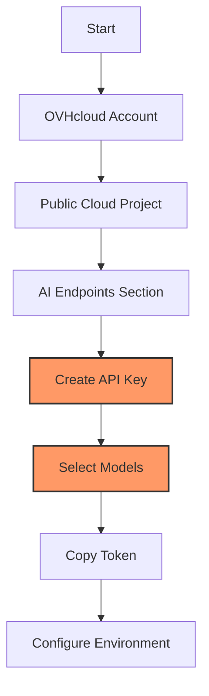

# LangChain Chatbot Workbook - Python Implementation

!!! info "About this workbook"
    This comprehensive workbook will walk you through building multiple AI chatbot variants using Python LangChain framework with OVHcloud AI Endpoints. Follow each step carefully to master chatbot development from basic to advanced implementations.

## Prerequisites

- [ ] OVHcloud account with AI Endpoints access
- [ ] Python 3.12+ installed
- [ ] Basic Python programming knowledge
- [ ] Understanding of virtual environments
- [ ] Linux/macOS/Windows environment

## Understanding the Code

Before we start, let's understand what we'll be building. This workbook covers four different chatbot implementations, each building upon the previous:

!!! example "Source Code Overview"
    
    === "📋 All Files"
        **Repository**: [ovh/public-cloud-examples](https://github.com/ovh/public-cloud-examples/tree/main/ai/ai-endpoints/python-langchain-chatbot)
        
        | File | Purpose | Action |
        |------|---------|--------|
        | `requirements.txt` | Python dependencies | [📥 Download](https://raw.githubusercontent.com/ovh/public-cloud-examples/main/ai/ai-endpoints/python-langchain-chatbot/requirements.txt) |
        | `chatbot.py` | Basic blocking chatbot | [📥 Download](https://raw.githubusercontent.com/ovh/public-cloud-examples/main/ai/ai-endpoints/python-langchain-chatbot/chatbot.py) |
        | `chatbot-streaming.py` | Streaming responses | [📥 Download](https://raw.githubusercontent.com/ovh/public-cloud-examples/main/ai/ai-endpoints/python-langchain-chatbot/chatbot-streaming.py) |
        | `chatbot-memory.py` | Memory-enabled chatbot | [📥 Download](https://raw.githubusercontent.com/ovh/public-cloud-examples/main/ai/ai-endpoints/python-langchain-chatbot/chatbot-memory.py) |
        | `chatbot-streaming-rag.py` | RAG with streaming | [📥 Download](https://raw.githubusercontent.com/ovh/public-cloud-examples/main/ai/ai-endpoints/python-langchain-chatbot/chatbot-streaming-rag.py) |
        | `rag-files/content.txt` | RAG knowledge base | [📥 Download](https://raw.githubusercontent.com/ovh/public-cloud-examples/main/ai/ai-endpoints/python-langchain-chatbot/rag-files/content.txt) |

    === "📖 Code Structure"
        **Chatbot Evolution**:
        
        `chatbot.py`  
        Basic blocking chatbot with single question-answer interaction
        
        `chatbot-streaming.py`  
        Streaming responses for real-time user experience
        
        `chatbot-memory.py`  
        Conversation memory to maintain context across exchanges
        
        `chatbot-streaming-rag.py`  
        Retrieval-Augmented Generation with streaming and knowledge base
        
        ---
        
        **Key Features**:
        
        • **LangChain Framework** integration with OVHcloud AI Endpoints  
        • **Progressive complexity** from basic to RAG implementation  
        • **Streaming capabilities** for improved user experience  
        • **Memory management** for contextual conversations  
        • **Document retrieval** for knowledge-enhanced responses

    === "🚀 Complete Setup Commands"
        ```bash
        # Create chatbot directory and navigate to it
        mkdir ~/langchain-chatbot-demo
        cd ~/langchain-chatbot-demo
        
        # Create Python virtual environment
        python3 -m venv venv
        source venv/bin/activate  # Linux/macOS
        # OR for Windows: venv\Scripts\activate
        
        # Download all files at once
        curl -O https://raw.githubusercontent.com/ovh/public-cloud-examples/main/ai/ai-endpoints/python-langchain-chatbot/requirements.txt
        curl -O https://raw.githubusercontent.com/ovh/public-cloud-examples/main/ai/ai-endpoints/python-langchain-chatbot/chatbot.py
        curl -O https://raw.githubusercontent.com/ovh/public-cloud-examples/main/ai/ai-endpoints/python-langchain-chatbot/chatbot-streaming.py
        curl -O https://raw.githubusercontent.com/ovh/public-cloud-examples/main/ai/ai-endpoints/python-langchain-chatbot/chatbot-memory.py
        curl -O https://raw.githubusercontent.com/ovh/public-cloud-examples/main/ai/ai-endpoints/python-langchain-chatbot/chatbot-streaming-rag.py
        mkdir rag-files
        curl -o rag-files/content.txt https://raw.githubusercontent.com/ovh/public-cloud-examples/main/ai/ai-endpoints/python-langchain-chatbot/rag-files/content.txt
        
        # Install dependencies
        pip install -r requirements.txt
        
        # Configure your environment
        echo "OVH_AI_ENDPOINTS_ACCESS_TOKEN=your_token_here" > .env
        echo "OVH_AI_ENDPOINTS_MODEL_NAME=Mistral-7B-Instruct-v0.3" >> .env
        echo "OVH_AI_ENDPOINTS_MODEL_URL=https://mistral-7b-instruct-v03.endpoints.kepler.ai.cloud.ovh.net/api/openai_compat/v1" >> .env
        echo "OVH_AI_ENDPOINTS_EMBEDDING_MODEL_NAME=multilingual-e5-large" >> .env
        
        # Test the basic chatbot
        python chatbot.py
        ```

## Step 1: System Setup and Python Installation

!!! tip "System Requirements"
    This workbook requires Python 3.12+ and pip for optimal LangChain compatibility. Choose your operating system below.

=== "Debian/Ubuntu"
    ```bash
    # Update system
    sudo apt update && sudo apt upgrade -y

    # Install Python 3.12+ and dependencies
    sudo apt install python3 python3-pip python3-venv curl -y

    # Verify Python version (should be 3.12+)
    python3 --version
    ```

=== "CentOS/RHEL"
    ```bash
    # Update system
    sudo yum update -y

    # Install Python and dependencies
    sudo yum install python3 python3-pip python3-venv curl -y

    # Verify installation
    python3 --version
    ```

=== "macOS"
    ```bash
    # Install Homebrew if needed
    /bin/bash -c "$(curl -fsSL https://raw.githubusercontent.com/Homebrew/install/HEAD/install.sh)"

    # Install Python 3.12+
    brew install python@3.12

    # Verify installation
    python3 --version
    ```

=== "Windows"
    ```powershell
    # Download Python from python.org and install
    # Or use Windows Package Manager
    winget install Python.Python.3.12

    # Verify installation
    python --version
    ```

## Step 2: Get OVHcloud AI Endpoints Access Token

!!! warning "AI Endpoints Access Required"
    This workbook requires access to OVHcloud's AI Endpoints with LLM and embedding models. You'll need an API access token.

### Token Acquisition Steps

- [ ] Go to [OVHcloud AI Endpoints](https://www.ovhcloud.com/en/public-cloud/ai-endpoints/)
- [ ] Create account or sign in
- [ ] Navigate to **Public Cloud** dashboard
- [ ] Create or select existing Public Cloud Project
- [ ] Go to **AI Endpoints** → **API keys**
- [ ] Click **Create a new API key**
- [ ] Copy the generated token

!!! tip "Model Selection"
    For this workbook, you'll need access to:
    - **LLM Model**: Mistral-7B-Instruct-v0.3 (or similar)
    - **Embedding Model**: multilingual-e5-large (for RAG implementation)



## Step 3: Create Demo Environment

```bash
# Create demo directory
mkdir ~/langchain-chatbot-demo
cd ~/langchain-chatbot-demo

# Create Python virtual environment
python3 -m venv venv

# Activate virtual environment
source venv/bin/activate  # Linux/macOS
# OR for Windows: venv\Scripts\activate

# Upgrade pip
pip install --upgrade pip
```

Expected output:
```
Successfully installed pip-24.x.x
```

## Step 4: Download and Install Dependencies

Download the requirements file and install all necessary LangChain components:

```bash
# Download requirements.txt
curl -o requirements.txt https://raw.githubusercontent.com/ovh/public-cloud-examples/main/ai/ai-endpoints/python-langchain-chatbot/requirements.txt

# Install all dependencies
pip install -r requirements.txt

# Verify LangChain installation
python -c "import langchain; print(f'LangChain version: {langchain.__version__}')"
```

You should see output showing the installed LangChain version and its components.

## Step 5: Configure Environment Variables

Create a configuration file for your OVHcloud AI Endpoints credentials:

```bash
# Create environment configuration file
nano .env
```

Add your OVHcloud configuration:

```bash
# OVHcloud AI Endpoints Configuration
OVH_AI_ENDPOINTS_ACCESS_TOKEN=your_actual_token_here

# Model Configuration
OVH_AI_ENDPOINTS_MODEL_NAME=Mistral-7B-Instruct-v0.3
OVH_AI_ENDPOINTS_MODEL_URL=https://mistral-7b-instruct-v03.endpoints.kepler.ai.cloud.ovh.net/api/openai_compat/v1

# Embedding Model (for RAG)
OVH_AI_ENDPOINTS_EMBEDDING_MODEL_NAME=multilingual-e5-large
```

!!! note "Model URLs"
    Replace the model URLs with your actual endpoints from the [AI Endpoints catalog](https://endpoints.ai.cloud.ovh.net/).

## Step 6: Download Chatbot Files

Download all the chatbot implementation files:

=== "Option 1: Download Individual Files"
    ```bash
    # Download core chatbot files
    curl -o chatbot.py https://raw.githubusercontent.com/ovh/public-cloud-examples/main/ai/ai-endpoints/python-langchain-chatbot/chatbot.py
    curl -o chatbot-streaming.py https://raw.githubusercontent.com/ovh/public-cloud-examples/main/ai/ai-endpoints/python-langchain-chatbot/chatbot-streaming.py
    curl -o chatbot-memory.py https://raw.githubusercontent.com/ovh/public-cloud-examples/main/ai/ai-endpoints/python-langchain-chatbot/chatbot-memory.py
    curl -o chatbot-streaming-rag.py https://raw.githubusercontent.com/ovh/public-cloud-examples/main/ai/ai-endpoints/python-langchain-chatbot/chatbot-streaming-rag.py
    
    # Create RAG directory and download content
    mkdir rag-files
    curl -o rag-files/content.txt https://raw.githubusercontent.com/ovh/public-cloud-examples/main/ai/ai-endpoints/python-langchain-chatbot/rag-files/content.txt
    ```

=== "Option 2: Clone Repository"
    ```bash
    # Clone the repository
    git clone https://github.com/ovh/public-cloud-examples.git
    
    # Copy chatbot files to your demo directory
    cp public-cloud-examples/ai/ai-endpoints/python-langchain-chatbot/*.py .
    cp -r public-cloud-examples/ai/ai-endpoints/python-langchain-chatbot/rag-files .
    
    # Clean up
    rm -rf public-cloud-examples
    ```

## Step 7: Test Basic Chatbot Implementation

Let's start with the simplest chatbot to verify your setup:

```bash
# Load environment variables
set -a && source .env && set +a

# Test the basic chatbot
python chatbot.py
```

Expected output:
```
👤: What is OVHcloud?
🤖: OVHcloud is a global cloud computing company that provides web hosting, dedicated servers, public and private cloud infrastructure, and domain registration services...
```

!!! tip "Understanding the Basic Chatbot"
    The basic chatbot (`chatbot.py`) demonstrates:
    - LangChain integration with OVHcloud AI Endpoints
    - Simple prompt template usage
    - Blocking (synchronous) AI model invocation

## Step 8: Implement Streaming Chatbot

Now let's test the streaming version for real-time responses:

```bash
# Run the streaming chatbot
python chatbot-streaming.py
```

You should see the response appear gradually, word by word, simulating a natural typing experience.

!!! example "Streaming vs Blocking"
    **Blocking**: Waits for complete response before displaying  
    **Streaming**: Displays response incrementally as it's generated

## Step 9: Test Memory-Enabled Chatbot

The memory-enabled chatbot maintains conversation context:

```bash
# Run the memory chatbot
python chatbot-memory.py
```

Expected output:
```
👤: Hello, my name is Stéphane
🤖: Hello Stéphane! Nice to meet you. I'm Nestor, your virtual assistant...

👤: What is my name?
🤖: Your name is Stéphane, as you mentioned when you introduced yourself...
```

!!! tip "Memory Window"
    This implementation uses a memory window of 10 exchanges, keeping the last 10 question-answer pairs for context.

## Step 10: Implement RAG-Enabled Chatbot

The most advanced implementation uses Retrieval-Augmented Generation:

```bash
# Run the RAG chatbot
python chatbot-streaming-rag.py
```

Expected output:
```
👤: Which company created AI Endpoints?
🤖: Based on the provided context, OVHcloud created AI Endpoints. OVHcloud's AI Endpoints platform is designed to provide developers with access to powerful AI models...
```

!!! example "RAG Architecture"
    **Components**:
    - **Document Loader**: Reads content from `rag-files/content.txt`
    - **Text Splitter**: Breaks documents into chunks
    - **Embedding Model**: Creates vector representations
    - **Vector Store**: Stores searchable embeddings (using Chroma)
    - **Retriever**: Finds relevant context for queries

## Step 11: Interactive Chatbot Development

Let's create an interactive version of each chatbot for hands-on testing:

```bash
# Create interactive chatbot script
nano interactive_chatbot.py
```

```python
import os
import sys
from langchain_mistralai import ChatMistralAI
from langchain_core.prompts import ChatPromptTemplate
from langchain.chains import ConversationChain
from langchain.memory import ConversationBufferWindowMemory

# Load environment variables
OVH_AI_ENDPOINTS_ACCESS_TOKEN = os.environ.get('OVH_AI_ENDPOINTS_ACCESS_TOKEN')
OVH_AI_ENDPOINTS_MODEL_NAME = os.environ.get('OVH_AI_ENDPOINTS_MODEL_NAME')
OVH_AI_ENDPOINTS_MODEL_URL = os.environ.get('OVH_AI_ENDPOINTS_MODEL_URL')

if not all([OVH_AI_ENDPOINTS_ACCESS_TOKEN, OVH_AI_ENDPOINTS_MODEL_NAME, OVH_AI_ENDPOINTS_MODEL_URL]):
    print("❌ Missing environment variables. Please check your .env file.")
    sys.exit(1)

# Configure the model
model = ChatMistralAI(
    model=OVH_AI_ENDPOINTS_MODEL_NAME,
    api_key=OVH_AI_ENDPOINTS_ACCESS_TOKEN,
    endpoint=OVH_AI_ENDPOINTS_MODEL_URL,
    max_tokens=1500,
    streaming=True
)

# Setup memory and conversation
memory = ConversationBufferWindowMemory(k=5)
prompt = ChatPromptTemplate.from_messages([
    ("system", "You are Nestor, a helpful virtual assistant. The conversation history is: {history}"),
    ("human", "{input}"),
])

conversation = ConversationChain(llm=model, memory=memory, prompt=prompt)

print("🤖 Nestor AI Assistant (powered by OVHcloud AI Endpoints)")
print("Type 'quit' to exit\n")

while True:
    user_input = input("👤 You: ")
    if user_input.lower() in ['quit', 'exit', 'bye']:
        print("🤖 Goodbye! Thanks for chatting with Nestor.")
        break
    
    print("🤖 Nestor: ", end="", flush=True)
    try:
        response = conversation.predict(input=user_input)
        print()  # New line after streaming response
    except Exception as e:
        print(f"❌ Error: {e}")
```

Test the interactive chatbot:

```bash
# Run interactive chatbot
python interactive_chatbot.py
```

## Step 12: Testing Scenarios

### Scenario A: Basic Q&A Testing

Test each chatbot variant with consistent questions:

**Test Questions:**
1. "What is OVHcloud?"
2. "What services does OVHcloud provide?"
3. "How does AI Endpoints work?"

**Run Tests:**
```bash
# Test each implementation
echo "Testing Basic Chatbot..."
python chatbot.py

echo "Testing Streaming Chatbot..."
python chatbot-streaming.py

echo "Testing Memory Chatbot..."
python chatbot-memory.py

echo "Testing RAG Chatbot..."
python chatbot-streaming-rag.py
```

### Scenario B: Memory Persistence Testing

Test the memory chatbot's ability to maintain context:

1. **Introduction**: "Hello, I'm working on a Python project"
2. **Follow-up**: "What programming language am I using?"
3. **Context Test**: "Can you help me with my project?"

### Scenario C: RAG Knowledge Testing

Test the RAG chatbot's ability to use the knowledge base:

1. **Knowledge Query**: "What are the security features of AI Endpoints?"
2. **Specific Details**: "How does OVHcloud protect my data?"
3. **Technical Features**: "What APIs does AI Endpoints support?"

## Expected Results

✅ **Successful Implementation:**

- All four chatbot variants run without errors
- Basic chatbot provides single responses to queries
- Streaming chatbot shows real-time response generation
- Memory chatbot maintains conversation context across exchanges
- RAG chatbot incorporates knowledge base content in responses

✅ **Learning Outcomes:**

- Understanding of LangChain framework architecture
- Experience with different response generation patterns
- Knowledge of memory management in conversations
- Practical implementation of RAG systems
- Integration skills with cloud-based AI services

## Troubleshooting

### Common Issues

**Environment Variable Errors:**
```bash
# Test your environment variables
python -c "import os; print('Token:', 'SET' if os.environ.get('OVH_AI_ENDPOINTS_ACCESS_TOKEN') else 'MISSING')"
```

**LangChain Import Errors:**
```bash
# Reinstall LangChain components
pip uninstall langchain langchain-mistralai langchain-community -y
pip install -r requirements.txt
```

**Model Connection Issues:**
- Verify your model URLs in the AI Endpoints catalog
- Check token permissions and expiration
- Ensure selected models are available in your region

**RAG Implementation Problems:**
- Verify `rag-files/content.txt` exists and contains text
- Check embedding model configuration
- Ensure sufficient memory for vector operations

**Streaming Issues:**
- Check network connectivity and latency
- Verify streaming parameter is set to `True`
- Monitor console output for error messages

## Clean Up

```bash
# Deactivate virtual environment when done
deactivate

# Optional: Save your implementations
mkdir implementations-backup
cp *.py implementations-backup/
cp -r rag-files implementations-backup/

# Optional: Remove demo directory
# rm -rf ~/langchain-chatbot-demo
```

## Quick Start Commands Summary

```bash
# Complete setup (copy-paste friendly)
mkdir ~/langchain-chatbot-demo && cd ~/langchain-chatbot-demo
python3 -m venv venv && source venv/bin/activate

# Download all files
curl -o requirements.txt https://raw.githubusercontent.com/ovh/public-cloud-examples/main/ai/ai-endpoints/python-langchain-chatbot/requirements.txt
curl -o chatbot.py https://raw.githubusercontent.com/ovh/public-cloud-examples/main/ai/ai-endpoints/python-langchain-chatbot/chatbot.py
curl -o chatbot-streaming.py https://raw.githubusercontent.com/ovh/public-cloud-examples/main/ai/ai-endpoints/python-langchain-chatbot/chatbot-streaming.py
curl -o chatbot-memory.py https://raw.githubusercontent.com/ovh/public-cloud-examples/main/ai/ai-endpoints/python-langchain-chatbot/chatbot-memory.py
curl -o chatbot-streaming-rag.py https://raw.githubusercontent.com/ovh/public-cloud-examples/main/ai/ai-endpoints/python-langchain-chatbot/chatbot-streaming-rag.py
mkdir rag-files
curl -o rag-files/content.txt https://raw.githubusercontent.com/ovh/public-cloud-examples/main/ai/ai-endpoints/python-langchain-chatbot/rag-files/content.txt

# Install dependencies
pip install -r requirements.txt

# Configure environment
echo "OVH_AI_ENDPOINTS_ACCESS_TOKEN=your_token_here" > .env
echo "OVH_AI_ENDPOINTS_MODEL_NAME=Mistral-7B-Instruct-v0.3" >> .env
echo "OVH_AI_ENDPOINTS_MODEL_URL=https://your-model-endpoint-url" >> .env
echo "OVH_AI_ENDPOINTS_EMBEDDING_MODEL_NAME=multilingual-e5-large" >> .env

# Load environment and test
set -a && source .env && set +a
python chatbot.py
```

This workbook successfully demonstrates progressive chatbot development using LangChain and OVHcloud AI Endpoints, from basic implementations to advanced RAG systems with streaming and memory capabilities.